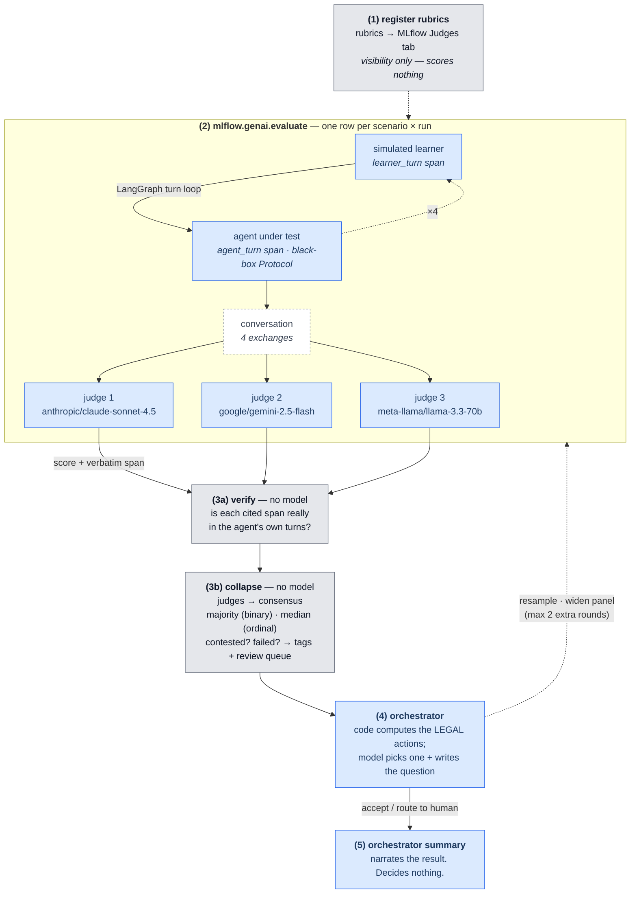
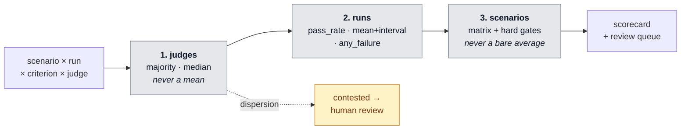
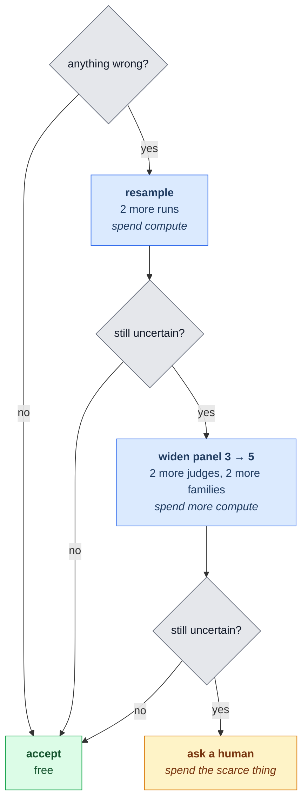
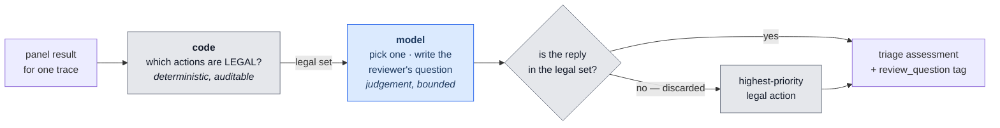
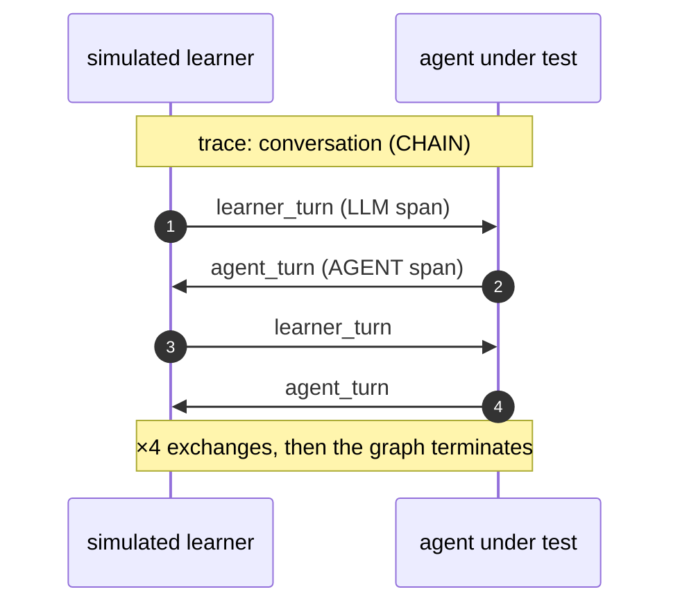

# conversation-eval — how it works, and how to read it in MLflow

A multi-agent evaluation harness for a **conversational** AI product. The system under
test is a coaching agent that runs a role-play with an adult learner; the harness
simulates the learner, scores the resulting conversation with a panel of LLM judges from
three different model families, collapses their votes deterministically, and routes
anything unreliable to a human.

The thing being demonstrated is not "an LLM can score text". It is everything around
that: **how you keep a stochastic judge honest, and what you do when the judges
disagree.**

---

## Run it

```bash
python -m conveval evaluate                  # the main entry point
mlflow ui --backend-store-uri sqlite:///mlflow.db
```

Then open <http://localhost:5000> and pick the **conversation-eval** experiment.

> Plain `mlflow ui` reads `./mlruns` and shows an empty list. The `--backend-store-uri`
> flag is not optional.

Useful variants:

| command | what it does |
|---|---|
| `python -m conveval evaluate --runs 3` | 3 runs per scenario. Disagreement is emergent, so this is the reliable way to produce a contested case |
| `python -m conveval evaluate --builtin-safety` | also runs MLflow's built-in `Safety` judge |
| `python -m conveval pipeline` | prints the architecture and which model is bound to each role |
| `python -m conveval review` | lists traces awaiting human review |
| `python -m conveval run` | fast console path, no tracking server |
| `pytest tests/ -q` | 62 tests, one per design decision |

`evaluate` narrates itself as it runs, in five numbered steps matching the pipeline
below.

---

## The pipeline

Blue is a **model** making a judgement. Grey is **deterministic code**. The boundary
between them is the design.



Step **4** is the only mixed node: its input set is computed in code, and the model
chooses within it. It is also the only one that can send work BACK — that dotted edge
is the escalation ladder, and it is what makes this a control loop rather than a
pipeline. See [the orchestrator](#the-orchestrator-and-what-it-is-not-allowed-to-do).

### Who is an agent, and who is not

| component | agent? | why |
|---|---|---|
| **agent under test** | yes | the thing being evaluated. Reached only through a `Protocol`, so the harness never learns how it is built |
| **simulated learner** | yes | plays a human with a persona, a goal and a situation |
| **judge panel** | yes ×3 | three models, three families, each scoring independently and blind to the others |
| **orchestrator** | yes | walks the escalation ladder: decides how much more evidence to gather and who reviews. Never decides a score |
| **aggregation, verification, gates** | **no** | plain deterministic Python. This is on purpose — see below |

---

## The five design decisions worth asking about

**1. Aggregation order is the design.** Four dimensions collapse in a fixed order, with a
*different function at each step*:



- **judges first**, because judge disagreement is *measurement noise* and must be
  surfaced before it propagates. Majority vote for binary criteria, **median** for
  ordinal — never a mean. Scores of 4/4/1 have a mean of 3.0, which is a score nobody
  gave, decided by a single outlier.
- **then runs**: `pass_rate` for correctness, `mean + interval` for quality,
  `any_failure` for safety-shaped criteria. Using one function everywhere is the most
  common way an eval suite reports a healthy number over a broken system.
- **then scenarios**: never a bare average. A mean hides one catastrophically broken
  scenario behind several healthy ones. The output is a matrix plus hard gates.

**2. The judges must not mark their own homework.** The agent under test runs on
OpenAI; no judge shares its family. Self-preference bias is real and it is asserted in
code (`judge_families_are_independent()`), not merely intended — because swapping a
judge via an environment variable could silently reintroduce it.

**3. Every verdict must cite a verbatim span, and the citation is checked in code.**
A judge that quotes text which does not appear in the agent's own turns is
hallucinating, and that is catchable for free — no second model, microseconds. This
runs on passes as well as failures: a pass is a claim about the transcript in exactly
the way a failure is.

**4. Disagreement is a routing signal, not something to average away.** When the panel
splits, the automated score is *unreliable* — a different thing from the agent behaving
badly. The suite records both separately and sends both to a human, for different
reasons.

**5. Deterministic where it can be.** Aggregation, gates, evidence verification and
the choice of *which actions are legal* are ordinary Python: repeatable, free, and
auditable line by line. Models are used only where judgement is genuinely required.

---

## The orchestrator, and what it is not allowed to do

### The escalation ladder

The orchestrator's job is to spend the cheapest resource that could settle the question,
and stop as early as it honestly can.



Each rung gets its own round, capped at two extra rounds. `resample` is legal only on
the first, `widen_panel` only on the second; after that the orchestrator must accept or
route. **The loop terminates by construction, not by a guard** — the model is never
offered an action that would extend it.

A real run:

```
round 0   disagreement -> resample       unfaithful -> resample    happy_path -> accept
          spent 68 extra model calls, 12 left in budget
round 1   disagreement -> judge_defect   unfaithful -> human_confirm
```

**Resampling does not always resolve the disagreement, and the demo shows that.** The
`disagreement` scenario is seeded to sit on a rubric boundary precisely so judges
legitimately split; on one recorded run it climbed all three rungs and still ended at a
human, on a 5-judge panel. A ladder that always resolved on step two would look rigged.
One that visibly exhausts the cheap options before spending a person is the argument for
building it.

### What it is not allowed to do

The orchestrator does **not** adjudicate contested traces. The suite's central claim is
that a contested score is unreliable; answering it with another score from the same
class of unreliable system dissolves the claim rather than resolving the trace.

So authority is split:



A reply naming an action outside the legal set is discarded in favour of the
highest-priority legal one. **The model cannot widen its own authority**, and there is a
test for exactly that.

| action | legal when | why it is distinct |
|---|---|---|
| `judge_defect` | a judge cited a span not in the transcript | the **instrument** is broken. No point adjudicating an argument built on something that did not happen, and no amount of extra sampling fixes it — so this outranks everything |
| `resample` | contested, first extra round, budget allows | more samples are cheaper than reviewer time |
| `widen_panel` | contested, second extra round, panel still 3, budget allows | sampling did not settle it; a wider panel is a better instrument |
| `human_tiebreak` | the panel disagreed and more evidence will not help | score unreliable; the human *is* the tie-break |
| `human_confirm` | the panel agreed the agent did badly | score reliable; the human confirms a real defect before it counts as a regression |
| `accept` | nothing contested, failed or unverifiable | the common case — and it costs **no model call at all** |

Three further invariants are enforced in code rather than asked of the model:

- **the panel stays odd** — widening goes 3 → 5, never 3 → 4, so a majority always exists
- **the round cap** — gathering actions stop being legal once the rounds are spent
- **the budget** — an action whose projected cost exceeds what remains is never offered,
  so the model cannot argue for a spend that was not available

---

## Reading it in MLflow

### Runs tab

One run per `evaluate`, named for what it *was* rather than `able-tern-461`:

```
gpt-4o-mini x 3scen x 1run | judges=claude+gemini+llama
```

The system under test and the judge panel are what change between runs and what you
compare, so both are in the name.

### Traces tab — four traces per run

| trace | what it is |
|---|---|
| `conversation` ×3 | one per scenario. The evaluated rows |
| `orchestrator_summary` | the orchestrator agent's own trace, so the agent topology is browsable rather than implied |

Filter with `tags.needs_review = 'true'` to get the review queue. Other useful tags:
`scenario`, `contested`, `failed`, `triage`, `review_question`.

### Inside a `conversation` trace

**Timeline / Details** shows the turn loop as it actually happened — not one opaque blob
of output text, but the sequence that produced it:



The learner is *ours* and is a model we prompt. The agent is reached only through the
`AgentUnderTest` protocol, so the graph never learns how it is implemented — it could be
an HTTP endpoint fronting a service in another language.

**Inputs / Outputs**:

- `scenario_brief` — the grounding the coach was given, and the yardstick faithfulness
  is judged against. It leads with the setting, who is being coached, the situation, and
  **what the coach does not know**; the framework comes last.
  The scenario *title* is deliberately absent: titles name what each scenario is testing
  ("Unfaithful: coach invents facts"), and this string is handed to every judge, so
  including it would announce the expected verdict before the panel read a word.
- `conversation` — the turns, as `{speaker, text}`.

**Assessments** — this is where the argument lives. Each criterion produces **four**
entries:

| assessment | source | value |
|---|---|---|
| `pedagogy__claude-sonnet-4.5` | LLM_JUDGE | that judge's score + its cited span |
| `pedagogy__gemini-2.5-flash` | LLM_JUDGE | ditto |
| `pedagogy__llama-3.3-70b-instruct` | LLM_JUDGE | ditto |
| `pedagogy` | **CODE / `panel-consensus`** | the collapsed result |

**`panel-consensus`** is the deterministic aggregation of the three votes above it —
majority for binary criteria, median for ordinal. It is logged as its own assessment,
attributed to CODE rather than to a model, so the UI shows *both* the individual votes
and the collapsed result. Its rationale spells out the arithmetic:

```
median of 3 judges: gemini-2.5-flash=3, claude-sonnet-4.5=2, llama-3.3-70b-instruct=5.
Agreement 25%. CONTESTED - the panel disagreed, so this score is unreliable and the
trace is queued for human review.
```

Emitting the individual judges rather than only the consensus is the whole point: an
aggregate that hides a 2-1 split is exactly what this project argues against, and the UI
can only show a split that was logged.

Flagged traces carry a fifth assessment, **`triage`**, written by the orchestrator: the
routing decision, plus the single question the reviewer must answer.

Every judge rationale carries its citation inline:

```
The coach invented a specific study and percentage that appear nowhere in the brief.
CITED: "The 2021 Harrison Institute study found that 68% of employees who ask for a
raise based on increased responsibilities are successful." [verified in transcript]
```

**`[verified in transcript]` is not written by the orchestrator, or by any model.** It is
`verify.py`: normalise both strings, then check whether the cited span occurs in the
agent's *own* turns. Plain Python, microseconds, no tokens. It runs inside the scorer,
long before the orchestrator exists — the orchestrator only *reads* the result when
deciding how to route.

Checking against the agent's turns rather than the whole transcript is deliberate: a
judge quoting the **learner** and attributing it to the coach is a genuine miss, and
folding the whole transcript into the haystack would conceal it. A judge whose span
cannot be found is marked `NOT FOUND IN TRANSCRIPT`, fails the `judge evidence
verifiable` gate, and routes that trace as `judge_defect`.

The hard part is *false* positives, since a verifier that flags honest judges gets
switched off. Three real reformatting behaviours are tolerated, all observed on the first
live run: judges quote the transcript **as presented to them** including the `COACH:`
label; they join several spans with `;` or newlines; and they silently swap curly quotes,
dashes and ellipses. Evidence is also only demanded where it is *meaningful* — a holistic
criterion like `pedagogy` has no single locatable span, and demanding one manufactured
false failures until `requires_evidence` existed.

### Judges tab

Each criterion's rubric, registered as a named judge, so a reviewer can read the standard
a score was given against without opening the source.

**These registered judges do not score anything.** Scoring is done by the three-model
panel, because the argument here is a *multi-model* panel and a registered MLflow judge
is one model. Registration is skipped when the rubric text is unchanged, so a version
bump means the yardstick actually moved.

### Human feedback and calibration

Add a verdict from the UI (**Assessments** on a trace) or from the CLI:

```bash
python -m conveval review --feedback <trace_id> pedagogy 4 yourname
```

The name must **match the judge's assessment name**. That is what turns a review into a
calibration datapoint: MLflow can then compare the human label against what the panel
said for the same criterion on the same trace — answering *"are the judges right?"*
rather than *"do the judges agree?"*. Those are different questions, and only the first
tells you whether the harness is trustworthy.

---

## Frameworks used, and where

**LangGraph** drives the learner ⇄ agent turn loop and nothing else. That loop is
genuinely cyclic with a termination condition, which is the shape a state graph is for.
Fan-out across scenarios and runs is plain concurrency; wrapping it in a graph would be
ceremony.

**MLflow** provides the evaluation harness (`mlflow.genai.evaluate`), tracing,
assessments, the judge registry and review queues. In the `evaluate` path MLflow's
harness is the *outer* orchestrator: it fans out over rows and calls the prediction
function and the scorers.

**On MLflow's LangChain autolog:** `mlflow.langchain.autolog()` does cover LangGraph, but
it requires the `langchain` package itself, and this project depends only on `langgraph`.
The turn loop carries explicit spans instead — no extra dependency, and it traces the
steps worth showing rather than every framework internal.

---

## The three scenarios

An evaluation demo where everything passes proves nothing: the scorecard is a number and
the machinery is invisible. Each scenario exists to demonstrate one thing.

| scenario | seeded behaviour | expected outcome |
|---|---|---|
| `happy_path` | none — the coach behaves | panel agrees, everything green |
| `unfaithful` | cites an invented study and salary band | panel agrees it failed → `human_confirm` |
| `disagreement` | asks one good question, then hands over a polished script | genuinely borderline → panel may split → `human_tiebreak` |

**Disagreement is emergent, not guaranteed.** Judges run at non-zero temperature, so any
given run may come back unanimous. Use `--runs 3` when a contested case is needed for a
demo. Reliably manufacturing judge disagreement is genuinely hard: two earlier attempts
overshot in opposite directions ("be lazy and reactive" → judges agreed it was *fine*,
5/4/5; "never elicit, hand a script" → judges agreed it was *bad*, 1/2/1). **Clear
output produces agreement in either direction.** Only a genuinely ambiguous case splits a
panel, so the scenario now parks the coach exactly on a rubric boundary.

---

## The rubric

| criterion | kind | fails when | aggregated across runs by |
|---|---|---|---|
| `faithfulness` | binary | the coach asserts a fact, figure or study absent from the brief | `pass_rate` |
| `in_scenario` | binary | the coach breaks role or answers as a generic assistant | `pass_rate` |
| `pedagogy` | ordinal 1-5 | scores ≤ 2 | `mean + interval` |

Binary where the question is **factual**, ordinal only where the judgement is **graded**.
A binary has one obvious reading; a 1-5 scale invites each judge to anchor differently.
The suite's own results bear this out — the binaries come back unanimous almost every
run, and the ordinal is the one that splits.

Criteria are kept **independent**: departing from the coaching framework while staying in
the role-play is scored under `pedagogy`, explicitly *not* under `in_scenario`. Without
that sentence in the rubric, judges read framework departure into both and one behaviour
was punished twice.

`Safety` is available as MLflow's built-in judge (`--builtin-safety`) rather than
hand-rolled — when a framework ships a validated judge, use it. It is off by default
because on coaching transcripts it returns "yes" on every row: a column that never varies
teaches a reviewer nothing and costs a model call per row.

---

## What this does not do

- **No judge-vs-human calibration is computed yet.** The datapoints are now recordable;
  nothing aggregates them into an agreement statistic. This is the most honest remaining
  gap.
- **Agreement is a simple fraction**, not Krippendorff's alpha.
- **No judge cascade.** Every judge scores every row; a cheap-model triage pass would cut
  cost on obvious rows.
- **The console path** (`run`, `explain`) still uses file fixtures and runs parallel to
  the MLflow path. Fine for iteration, but it is duplication.
